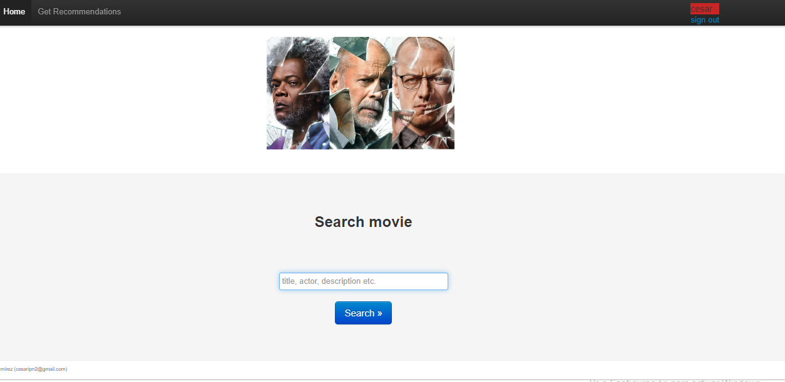
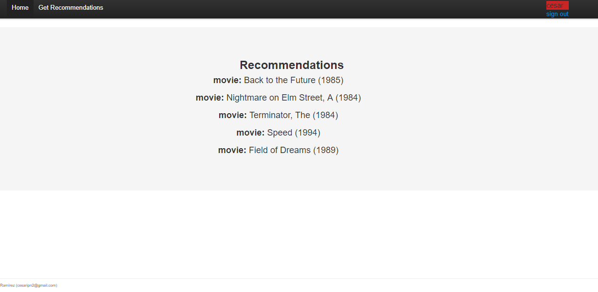

# Recommender-system-web-application

Web application that features three machine learning applications.

###NLP for query matching.

Information retrieval system implementing an TFIDF model and using cosine similarity to match
movie queries with the items available in the database.

###Recommender system for movies.

Users register into the application and rate movies that internally helps 
a Colaborative Filtering Item-Based model (and optionally a LogLikelihood 
model) to learn users’ preferences. 
The system updates automatically the model and gives recommendations to 
other users.

###Bayesian A/B testing for banners.

A module was developed to test the popularity of a series of banners.
An A/B test is performed using a Bernoulli model that is updated after each user click on a banner
and their display frequencies change depending on the state of the model.

####-Framework details.

This engine is written in Python, Scikit-Learn on top of NumPy and SciPy stack. It uses Django for webserver backend.

##Screenshots

Users log in into the system and can perform queries searching for movies based on their title, actors, descriptions etc.

The information retrieval system matches the query with the existing movies in the database. The application then
asks the user to rate the movies that are returned.

 

One by one the user rates each movie (that disappears from the page after is rated) and the system uses those values to update 
its recommender system.

If the user clicks on "Get Recommendations" the application will display the most similar movies to
the user's preferences.  

  

In the upper location of the page a banner is displayed and it is loaded each time the user refreshes the page or performs a search.
When the user clicks on the banner and a A/B test is performed internally
to display the banners based on their popularity. The next three banners are displayed. 

 

